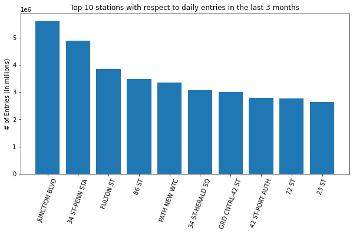

# Analysis on MTA Most Crowded Stations 
----------------------------------------------------------

 The point of this project is to discover the most crowded stations from the MTA dataset by applying
 Exploratory Data Analysis and based on the analysis we shall recommend the 5 topmost crowded stations
 to our client.
