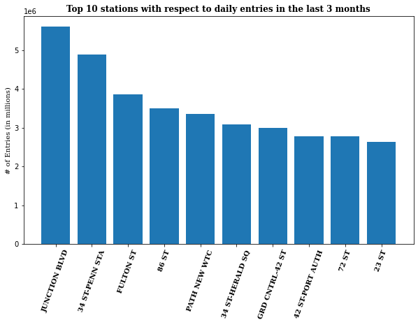

# Exploratory Data Analysis on MTA stations 

## Abstract 

The goal of this project is to use Exploratory Data Analysis to discover the most crowded stations in the MTA to recommend the most eligible locations that would solidify the position of our client in the market. 

## Design 

The project utilizes a dataset provided by the MTA that helps in getting information regarding the stations especially the turnstiles information. 

## Data 

The dataset contains over 2.7 million observations in the period from July to September of 2021, after grouping the data we reached 379 observations of the stations in the dataset.     

## Algorithms 

Exploratory data analysis techniques are used to clean the data and form a proper dataset that can be reasonably aggregated and visualized. 

## Tools 

Pandas for data manipulation 
Matplotlib and seaborn for plotting 

## Communication 

In addition to the visuals presented this plot is presented to further elaborate on the point of the project. 

